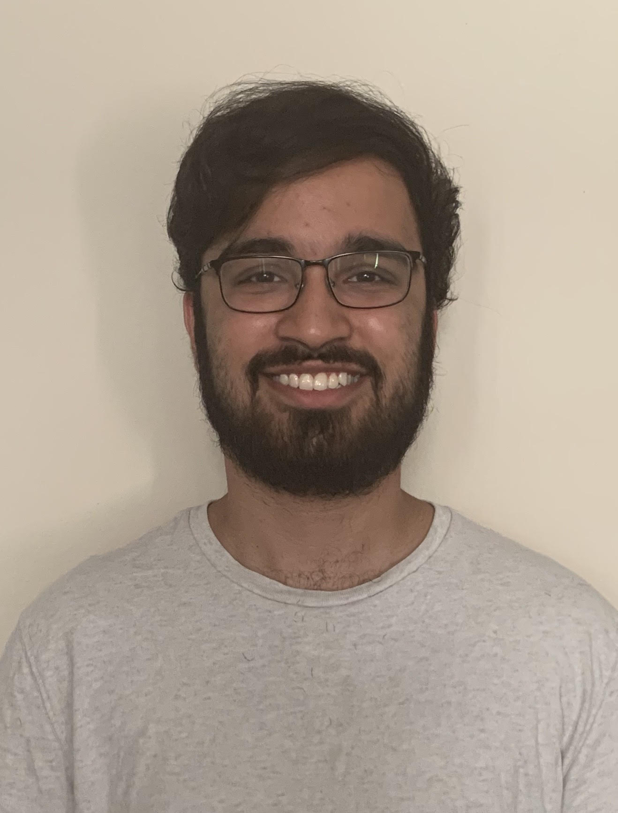

# Ahmed Hussaini's Personal Site
#### 4th Year **Computer Engineering** student
###### **email: _a5hussai@ucsd.edu_**

A ~~wise~~ man once said: 
> Start whenever, start rarely.

That man was me. 

My favorite coding concept is using a `class` since I can encapsulate my information. 

Here is a [link](https://www.linkedin.com/in/ah-2019/) to my LinkedIn. And here is a [link](#ahmed-hussainis-personal-site) to the top of my site. And now here's a relative [link](_config.yml) to the config.yml.

Here is a list of my favorite hobbies:

- Basketball
- Hiking
- Finding new restaurants with friends
- Video Games

And here is a nested list of my favorite parts of each hobby:

- Basketball
  - Shooting
  - Watching Lakers games
- Hiking
  - Uphill grind
- Finding restaurants
  - Eating (duh!)
  - Trying new food
- Video Games
  - RPGs
  - Open world adventures
  
Here are some of my life goals of recent years:

- [x] Transfer to a good school
- [x] Apply to the BS/MS program
- [x] Get back into workout shape
- [ ] Get an internship
- [ ] Plan world domination
- [ ] Reap the benefits
